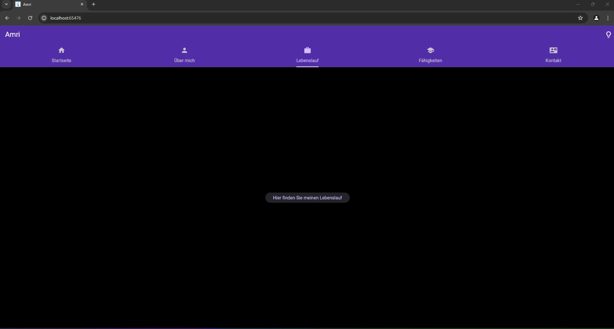

# Portfolioseite_5501560

Matrikelnummer: 5501560

Email : nouaman.amri@mnd.thm.de

Dokumentation zur Navigation und Seitenerstellung meiner Portfolio-App
Navigation
Die Navigation in meiner Portfolio-App erfolgt über den MaterialApp-Router und einen TabController. Der MaterialApp-Router regelt die Hauptstruktur der App, während der TabController die Tabs in der Navigationsleiste steuert.

Seitenbeschreibung
Startseite: Beinhaltet eine Begrüßungsnachricht und eine Einführung zur Portfolio-Seite.

Über mich: Beschreibt meine Interessen und Motivation, und bietet Links zur Kontaktaufnahme per E-Mail und LinkedIn.

Lebenslauf: Bietet einen Link zu meinem Lebenslauf als PDF.

Fähigkeiten: Diese Seite listet verschiedene Fähigkeiten von mir auf, begleitet von Bildern, die diese Fähigkeiten visuell darstellen

Kontakt: Enthält ein Formular, das Benutzern ermöglicht, mir eine Nachricht zu senden.

Implementierung und Widgets
MaterialApp-Router: Regelt das Routing und unterstützt helle sowie dunkle Themen.
TabController und TabBar: Steuern die Navigation zwischen den Seiten.
Seiten-Widgets: Jede Seite ist als eigenes Widget implementiert, mit spezifischen Inhalten und Layouts.

Benutzerfreundlichkeit und Gestaltung
Meine App verwendet Material Design Komponenten für eine ansprechende und konsistente Benutzeroberfläche, die sowohl auf Desktop- als auch auf mobilen Geräten gut aussieht. Die modulare Struktur fördert die Sauberkeit des Codes und erleichtert zukünftige Erweiterungen und Wartungen.

